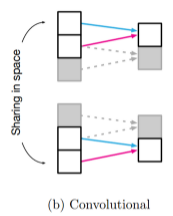

# Inductive Bias

Inductive Bias는 주어지지 않은 입력의 출력을 예측하는 것이다. 즉, 일반화의 성능을 높이기 위해서 만약의 상황에 대한 **추가적인 가정**이다. 다시 말해 보지 못한 데이터에 대해서도 귀납적 추론이 가능하도록하는 알고리즘이 가지고 있는 가정들의 집합을 Inductive Bias라고 한다.

## FCN (Fully Connnected Network)의 Inductive Bias

FCN은 각 layer의 element들이 모두 연결되어있다. (All-to-all) 이렇게 모든 element들이 모두 연결되어있으면 어떤 출력 요소던지 영향을 미칠 수 있기때문에 Inductive Bias가 약하다.

## CNN (Convolution Neural Network)

CNN은 Convolution Filter를 사용하여 일부에만 연산을 수행한다. 이렇게 Convolution Filter를 사용함으로써 Entity간의 locality(서로 가까운 element 간에 존재)를 가정한다고 볼 수 있다. 다시 말해 어떤 특징을 가지는 요소들이 서로 모여있는지가 중요한 문제에서 좋은 성능을 보여준다.

## CNN vs Transformer

- CNN: 이미지가 지역적으로 얻을 정보가 많다는 것을 가정 (local 정보)
- Transformer: PE(Positional Embedding)와 self-attention을 사용해 모든 정보를 활용 (global 정보)

위 내용을 바탕으로 Transformer는 CNN에 비해 Inductive Bias가 부족하다고 볼 수 있다!