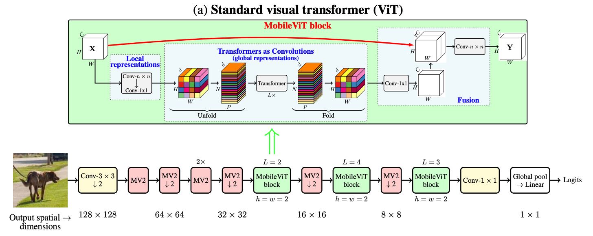
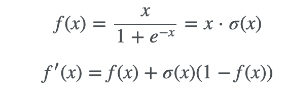
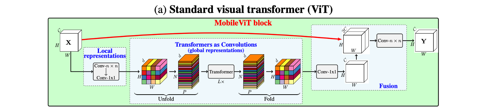
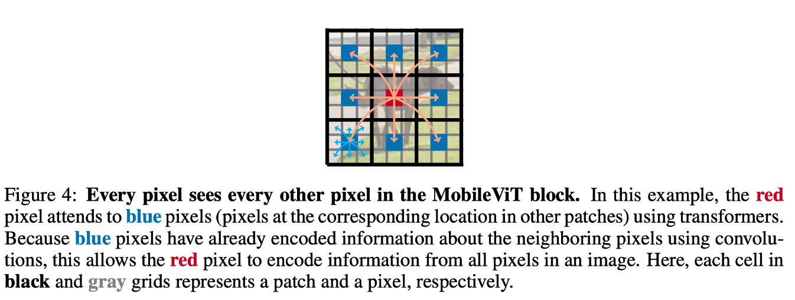
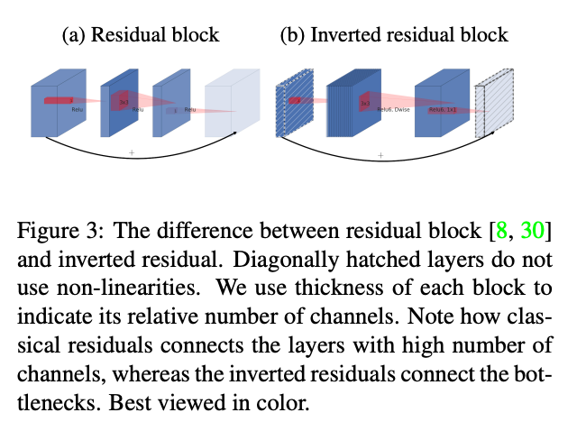
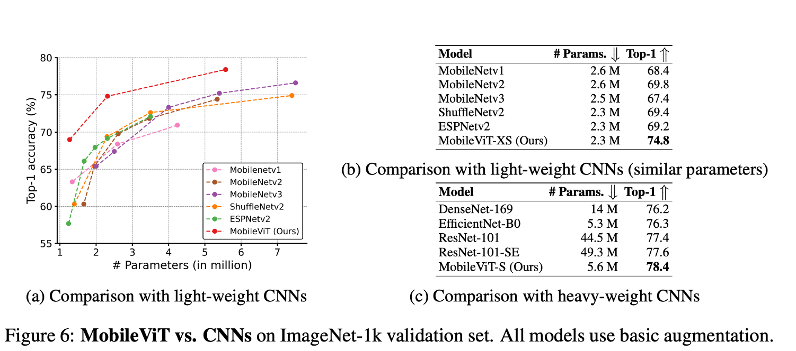
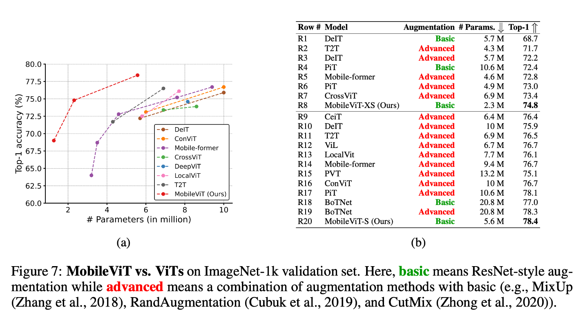
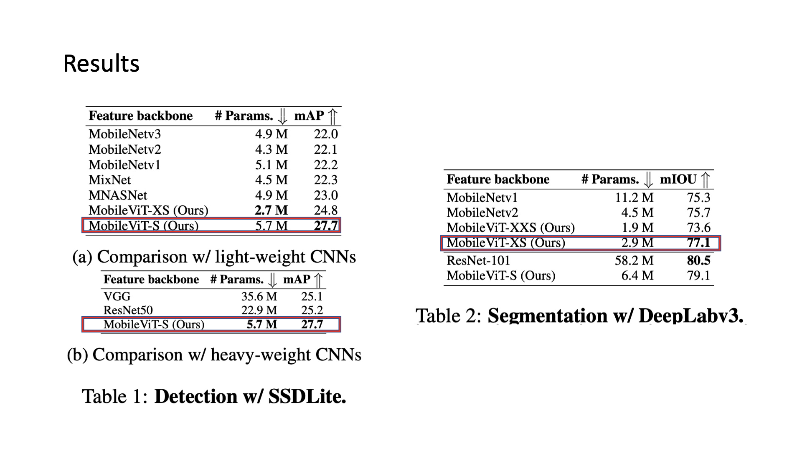
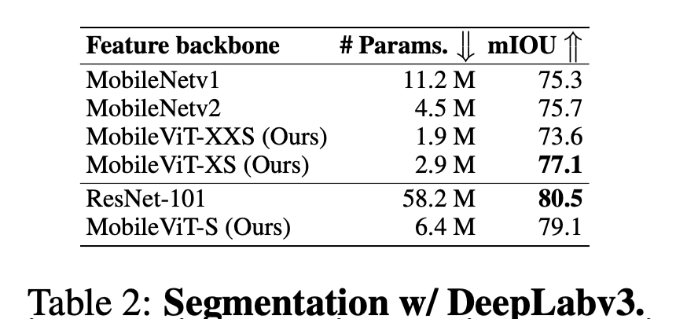
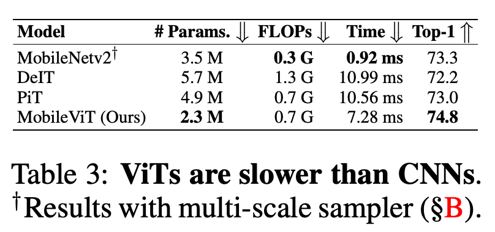

# MobileViT: Light-weight, General-purpose, and Mobile-friendly Vision Transformer

## ABSTRACT

- Vision Task에서 Transformer 계역 모델이 뛰어난성능을 보이고 있다. (ViT, DeiT 등)
- 하지만, Mobile Device에서 동작하기에는 한계가 있다.
    1. 모델 자체가 무겁다.
        - ViT-B/16 vs MobileNetv3 : 86million vs 7.5 million param
    2. Inference 속도가 느리가.
        - Transformer 연산이 Convolution 연산에 비해 모바일 디바이스에서 최적화 되어있지 않다.
    3. 학습과정에서 Data Augmentation과 Regularization Method에 매우 민감하다.
- MobileViT는?
    1. 비슷한 size의 모델과 비교했을 때 성능이 비교적 뛰어나다.
    2. Data Augmentation과 Regularization Method에 비교적 Robust하다.

    

### 1. Conv -n x n

단순한 n by n Convolution Layer

```python
def conv_xcx_bn(inp, oup, kernel_size=3, stride=1):
	return nn.Sequential(
		nn.Conv2d(inp, oup, kernel_size, stride, 1, bias=False),
		n.BatchNorm2d(oup),
		nn.SiLU()
	)
```

MobileViT에서는 n=3으로 사용

**SiLU란?**

- sigmoid를 통과한 값에 입력값 x를 곱한 값을 사용

    

### 2. MobileViT Block



Local한 Feature와 Global한 Feature를 모두 잡기 위해 고안

동작 과정

1. 3x3 conv + 1x1 conv
2. Transformer연산이 가능하도록 Rearrange(=Unfold)
3. Tranformer 연산(=MHA + FPN)
4. 원본의 shape으로 Rearrange(=Fold)
5. 1x1 conv
6. Input과 Concat
7. 7x7 conv

**1x1 conv를 사용하는 이유**

1. output channel size를 조절 가능하다.
    - e.g. input channel이 output channel보다 클 경우 저차원으로의 projection 동작과 동일
2. 적은 Computation으로 연산 대체 가능
3. Activation 연산을 통한 Non linearity 증가



- 앞부분의 Convolution 연산을 근접한 pixel의 relation 학습에 focus
- Transformer 연산은 Global한 feature 학습에 focus

### 3. MobileNetV2 Block

- 기존 MobileNetV2에서 사용한 Block을  그대로 착안(=inverted resblock)
- 기존 Residual Block이 dimension을 낮추고 convolution 연산을 진행하는데, 이는 정보 손실을 유발
- 따라서, 역으로 Dimension을 높이고(=inverted) convolution 연산을 수행
- 고차원에서의 Convolution 연산은 다양한 feature 학습의 여지가 있음



## Implementation

### Multi-scale Sampler Training

- 기존 Transformer 모델과는 다르게 Classification Token이 없다.
- 이유는 Convolutino + Unfold(fold) 연산이 Patch의 Order를 유지해주기 때문
- 따라서, 기존 ViT에서 Multi scale inference를 위해 Fine tuning을 했다면, MobileViT는 Scratch 학습 과정에서 CNN의 Multi scale sampler Traning을 적용함으로써 다양한 사이즈의 이미지 inference가 가능하도록함

## Results



- 비슷한 param수를 갖는 CNN 모델과 비교해보았을 때, 성능이 더 우수함을 확인
- 추가로 사이즈가 큰 CNN 모델과 비교했을때에도 성능이 더 우수함



- Transformer계열과 비교했을 때, 단순한 Augmentation을 썼음에도 성능이 더 좋음을 확인할 수 있음





- Dense prediction task에서도 적은 param으로 괜찮은 성능을 보여줌



가장 중요한 Real Device에서는?

- 다른 ViT 계열의 모델보다는 빠르다.
- 하지만, Mobilenet(cnn based)보다는 느리다.

이유는?

1. Transformer 연산이 Mobile Device에 최적화 되어있지 않다.
2. CNN 연산은 연구가 오래되어 이미 Device Level에서 최적화가 잘 되어있다.

## Conclusion

모바일에서 Transformer를 적용해보려는 시도로, mobilevit는 적은 param으로 좋은 성능을 낼 수 있다.

---

Author by `지승환`  
Edit by `김주영`