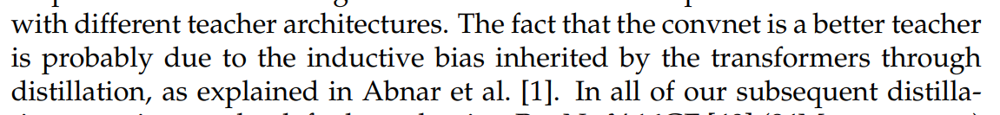
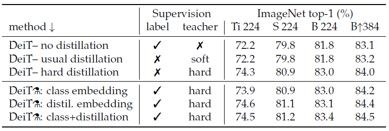
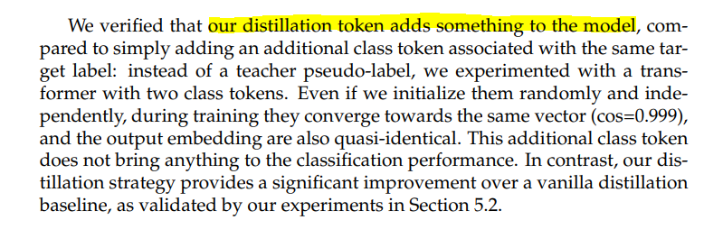

# Q&A

## CNN vs Transformer

teacher 모델이 transformer 말고 cnn 기반 네트워크를 사용했을때의 성능이 우수하다고 나왔는데 이유는 무엇일까요? inductive bias가 CNN에는 포함되어 있다고 논문에는 쓰여있는데 결국 이는 cnn이 transformer보다 우수하다는 의미 아닌가요??

>여기서 CNN이 transformer보다 better하다는 것은  knowledge distillation에서 teacher모델로 CNN이 transformer보다 더 좋은 teacher임을 의미합니다. 좋은 teacher란 본인이 가지고 있는 좋은 inductive bias를 student에게 전달하여 student 모델이 높은 성능을 낼 수 있도록 하기 때문입니다. transformer는 상대적으로 CNN보다 inductive bias가 약하기 때문에 student에게 전달해줄 수 있는 inductive bias가 별로 없겠지만 CNN은 inductive bias가 좀 더 강하기 때문에 student에게 전달해줄 수 있는 inductive bias가 좀 더 많겠네요.  table 2의 결과처럼 이러한 특성 때문에 teacher 모델로 CNN(RegNet)을 썼을 때 성능이 더 좋은 걸 알 수 있습니다. 또한, student의 성능이 teacher의 성능을 뛰어넘는 결과가 나옵니다. 이는 적절한 inductive bias가 주입되면 student 모델의 성능을 더욱 개선할 수 있음을 보여줍니다.
>

>말씀하신대로  CNN이 transformer보다 더 우수한 것으로 볼 수 있지 않느냐 라는 질문에는 table 5를 봐주시면 될 것 같습니다. 논문에서는 서로 다른 모델의 성능을 비교하기 위해 throughtput과 accuracy간의 trade-off 관점에서 성능을 비교합니다.  DeiT-B⚗ , DeiT-B⚗ /1000 epochs와 비슷한 throughput을 갖는 CNN 모델로 RegNetY-16GF, EfficientNet-B4를 예시로 들 수 있는데 두 CNN보다 DeiT의 성능이 더 잘 나오는 것을 알 수 있습니다.
>

## no distillation vs soft distillation 성능비교

distillation을 사용하지 않은 결과와 soft distillation을 사용한 결과의 차이가 거의 없는데 혹시 이유나 유추할 수 있는 부분이 논문에 나와있을까요? hard distillation에만 초점을 맞춘 것 같은데 궁금하네요.

> 질문을 보고 저도 왜 성능 차이가 없을까 궁금해서 찾아보는데 관련 내용이 안보이네요;; 아마 단지 실험 결과가 이렇다라는 것만 보여준 것이 아닐까 생각이 드네요.
>

>저도 이부분에 대해서 찾아봤지만 따로 설명이나 추가적인 자료는 찾지 못했습니다. 말씀하신대로 soft, hard distillation에 대한 성능 개선에만 집중하느라 크게 의미를 두지 않는 거 같습니다.
>

## distillation token

8 Page 가장 위에 있는 문단 입니다. 여기서 Distillation Token이 모델에 어떤 것(??)을 추가 했기 때문에 2개의 class token을 사용하는 것보다 성능이 미세하게 좋다고 합니다. Class Token과 다르게 어떤 것이 추가 되었는지가 안나와있는데 혹시 아시는 분 있을까요?

>distillation token이 'teacher model(CNN)이 가지고 있는 inductive bias를 student model에게 잘 전달했다'라고 보시면 될 거 같습니다.
>

---
  
Edit by `김주영`