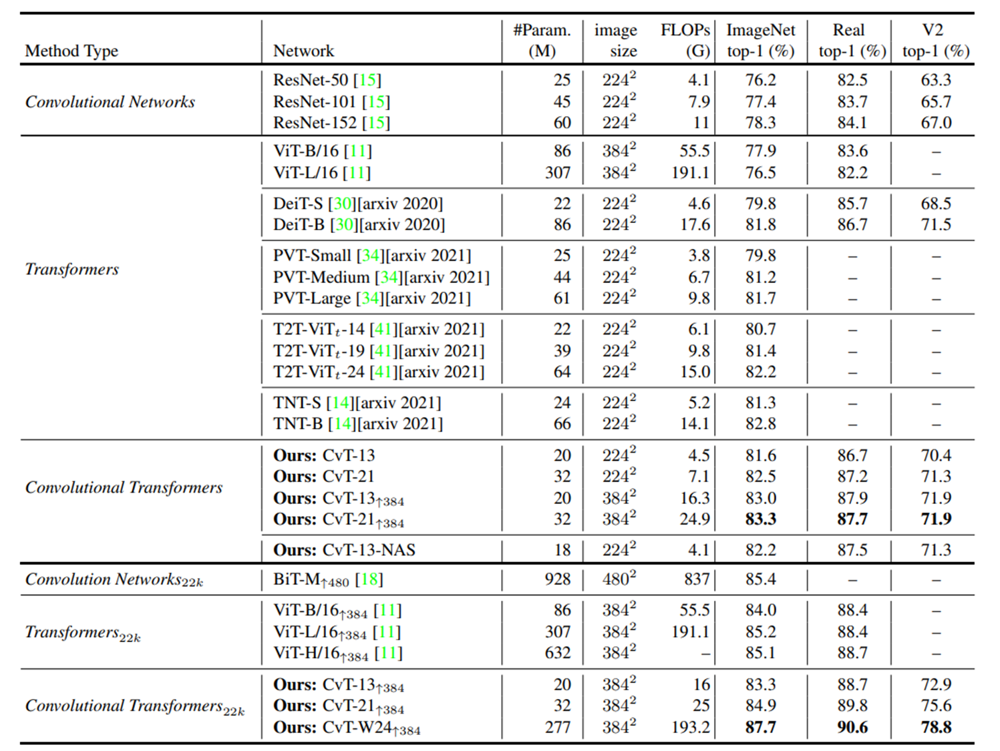

# Compact Vision Transformers

- CNN과 ViT는 각각의 특징이 있음

    

- 기존에 ViT는 비슷한 양의 데이터로 학습할 시의 비슷한 크기의 CNN과 비교했을 때 보다 성능이 떨어지는 문제가 있음.
- 이를 해결하기 위해서 **CNN 커널을 통해 계층적인 구조로 ViT 구조를 변경**하여, 저수준의 패터부터 고수준의 패턴까지 다양한 패턴을 학습할 수 있게 하려고 하였다.
    - 이를 통해 성능 향상과 robustness 향상을 가능하게 하였음.
    
## Model Architecture

**[특징 1]** partion the Transformers into multiple stages that form a hierachical structure of Transformers

- 각각의 stage는 **convolutional token embedding으로 구성**되어 있다.
- 각각의 stage는 **overlapping convolution을 수행**한다.
    - 2D로 reshape된 token map에 stride을 적용하여 수행한다.
- layer normalization을 사용한다.
    - 각 feature들에 대한 평균과 분산을 구해서 각 input을 정규화한다.
    
    ](imgs/09_2.png)
    
    출처 : [https://t.co/f9wcvwzNj6](https://t.co/f9wcvwzNj6)
    
- local information를 잡고, 각 stage마다 sequence length를 점점 줄이고, token feature들의 dimension을 늘린다.

**[특징 2]** Transformer 모듈에서 모든 self attention block 앞에 **linear projection**을 수행한다. 

- 2D로 reshape된 map에서 s x s의 depth-wise separable convolution을 수행한다.

    

    출처 : `Depthwise separable convolution architectures for plant disease classification`

### Convolutional Token Embedding

### Convloutional Projection

- multi-head attention 수행 시 position-wise linear projection을 depth-wise separable convolution으로 변경하였다.
- 기존의 연산량을 유지하면서 local spatial context 정보를 전달하고자 하였다.

### Convolutional Projection

- squeezed convolution projection을 통해 key와 value 매트릭스의 token 수를 줄여서 MHSA 연산의 계산 비용을 1/4로 감소시켰다.
- 인접한 패치들이 정보를 가지고 있기 대문에 성능에 영향을 별로 주지 않는다.

## Experiments

- 데이터셋 : ImageNet(1.3M images, 1k classes) , ImageNet-22k(14M images, 22k classes)
- CIFAR10/100, Oxford-IIIT-Pet, Oxford-IIIT-Flower에 downstream task 수행
- img size : (224, 224) | fine-tune 시 (384, 384)
- CvT-X : X는 block 수
- H : head 수	D : embedding feature dimension
- R : feature dimension expansion ratio in the ith MLP layer

    

- 여러 모델들과의 비교

    

- CVT에서 position embedding이 필요없음을 증명한 실험

    

- Convolutional token embedding의 효과

    

- Convolutional Projection에 stride를 적용했을 때 성능은 적게 떨어지고 연산량을 줄임

    

- Convolutional Projection을 stage마다 다 적용하면 성능이 좋다.

    

---

Author by `김지훈`  
Edit by `김주영`